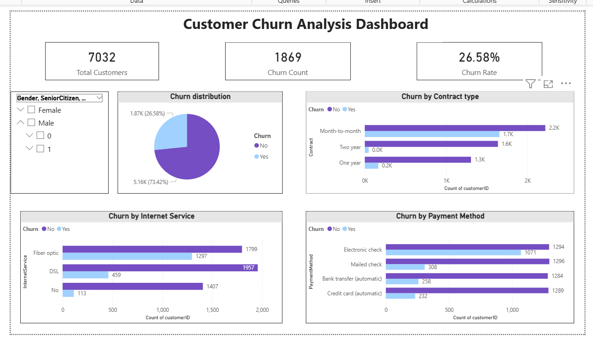

# 📊 Customer Churn Analysis using SQL

## 📌 Problem Statement
A telecom company is facing customer churn and wants to identify the key factors causing customers to leave. The goal is to analyze customer data and uncover patterns that drive churn to improve retention strategies.

---

## 🎯 Objectives
- Analyze customer churn using SQL  
- Identify high-risk customer segments  
- Understand factors affecting churn (contract, tenure, charges, services)  
- Provide business recommendations to reduce churn  

---

## 🛠️ Tools & Technologies
- SQL (MySQL Workbench)  
- Power BI (Dashboard Visualization)  
- Kaggle Dataset  

---

## 📊 Dataset Overview
The dataset contains telecom customer information including:

- Customer demographics (gender, senior citizen, dependents)  
- Account details (tenure, contract type, payment method)  
- Service usage (internet, tech support, streaming)  
- Financial data (monthly charges, total charges)  
- Churn status (Yes/No)  

---

## 🧾 SQL Concepts Used
- `GROUP BY` → Aggregation analysis  
- `CASE WHEN` → Segmentation (tenure, charges)  
- `AVG()` → Churn rate calculation  
- `COUNT()` → Customer distribution  
- Data Cleaning → Handling missing values  

---

## 🔍 Key Analysis Performed

### 1. Overall Churn Rate
- Calculated total customers and churn percentage  

### 2. Churn by Contract Type
- Compared churn across:
  - Month-to-month  
  - One-year  
  - Two-year  

### 3. Churn by Tenure
- Segmented customers into:
  - New (<12 months)  
  - Medium (12–24 months)  
  - Old (>24 months)  

### 4. Churn by Monthly Charges
- Categorized customers into:
  - Low  
  - Medium  
  - High charges  

### 5. Churn by Services
- Internet service  
- Tech support  
- Streaming services  

### 6. Customer Segmentation
- Identified high-risk customer groups  

---

## 📊 Key Insights (WITH BUSINESS MEANING)

- 📉 **High churn in month-to-month contracts**  
  → Customers without long-term commitment are more likely to leave  

- 🆕 **New customers churn the most**  
  → Poor onboarding or early dissatisfaction  

- 💰 **High monthly charges increase churn**  
  → Price-sensitive customers  

- 🛠️ **Lack of tech support increases churn**  
  → Service quality impacts retention  

- ⚠️ **High-risk segment identified:**  
  - Tenure < 12 months  
  - Monthly Charges > 70  
  - Month-to-month contract  

---

## 📸 Dashboard

  

---

## 💡 Business Recommendations

- Offer discounts for long-term contracts  
- Improve onboarding experience for new customers  
- Provide better support services (especially tech support)  
- Target high-charge customers with loyalty benefits  

---

## 📁 Project Structure
customer-churn-analysis-sql/
│
├── data/
├── sql/
├── dashboard/
├── README.md

---

## 🚀 Conclusion
This project demonstrates how SQL can be used to analyze customer churn and extract actionable business insights. The analysis highlights key drivers such as contract type, tenure, and pricing, helping businesses improve customer retention strategies.

---

## 👨‍💻 Author
Aditya Mishra  

---

